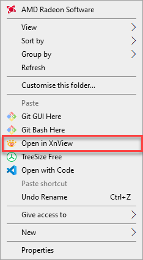

# Adding XnView to Windows Explorer Directory Context Menu

1. Open the file **xnview_add_to_context_menu_windows_10.reg** an text editor
2. Change all of the paths to where you installed XnView.
3. Save file
4. Install/Merge the file.

Now you can right click inside a directory and

Source for inspiration: [https://github.com/cbmeeks/sublime-text-2-context-menu-windows]
